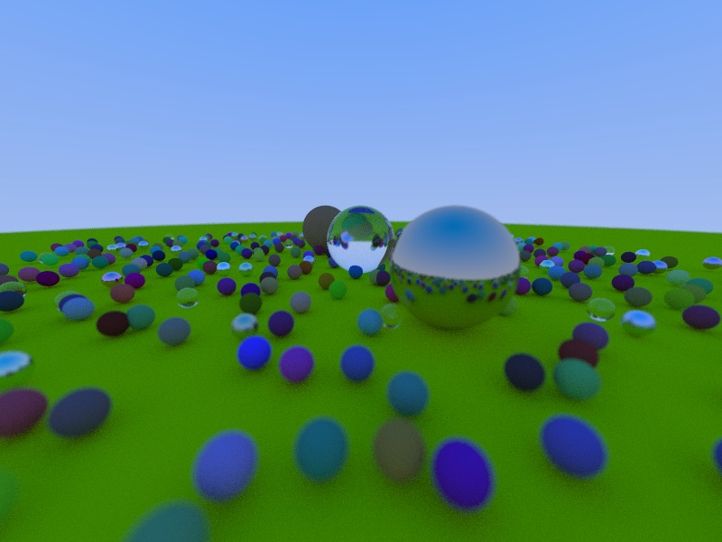

# RUST RAY TRACING

As part of the [100 days of code](https://www.100daysofcode.com/) challenge, I'm implementing Peter Shirley's Ray Tracing
book series on Rust.

There will be a log of my progress on my Twitter account [@ludusestars](https://twitter.com/LudusEstArs)

## RESULTS
### Ray Tracing in One Weekend:

